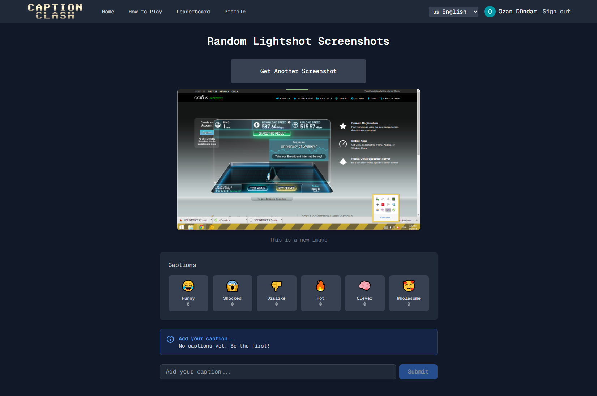
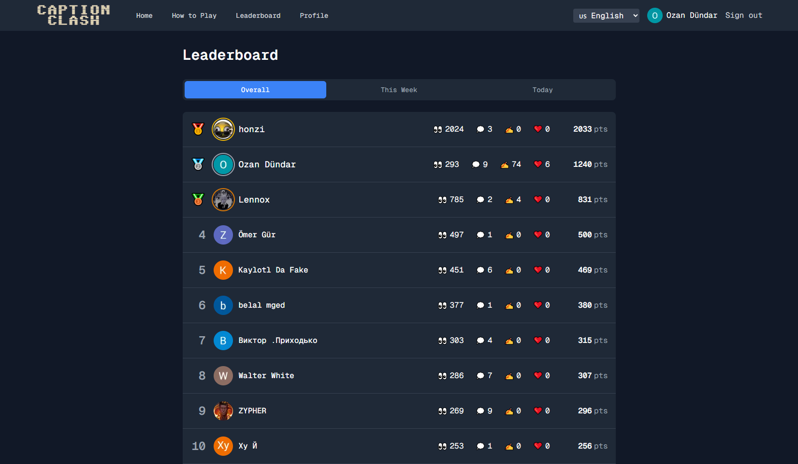
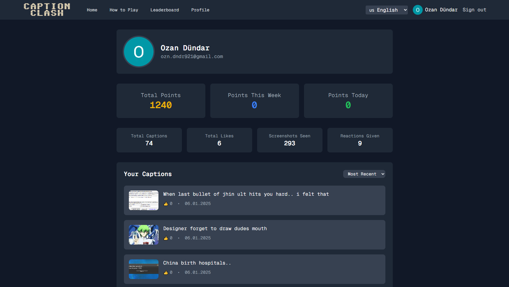
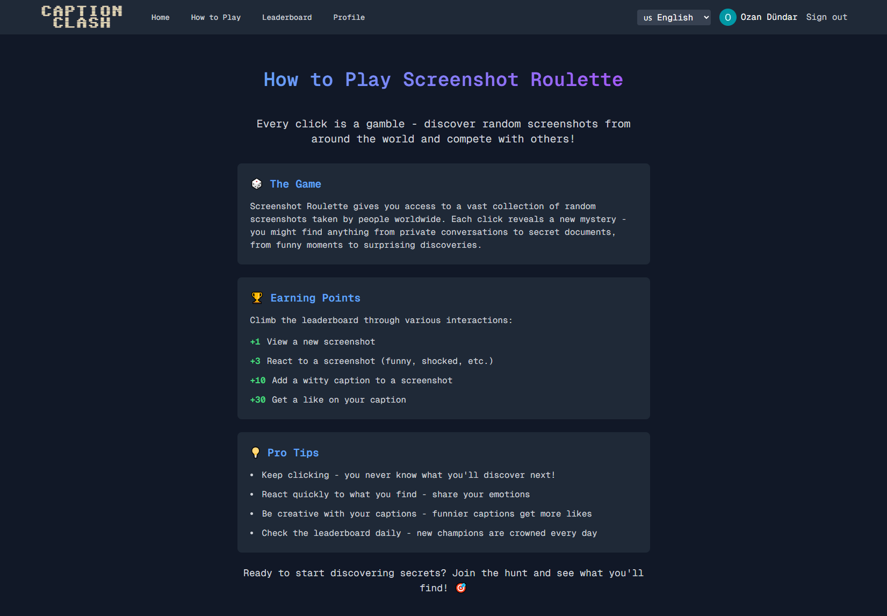

# Caption Clash

A screenshot discovery game that turns random internet screenshots into a social experience. Explore random images from Lightshot and compete with others by creating captions, earning points, and climbing the leaderboard.

Production URL: https://caption-clash.com/

## Screenshots


*Discover and caption random screenshots from around the internet*


*Compete with others on daily, weekly, and overall leaderboards*


*Track your stats, points, and captions*


*Learn the rules and start earning points*

## Project Overview

Caption Clash pulls random screenshots from Lightshot (prnt.sc), a popular screenshot sharing service with millions of daily uploads. These are unfiltered, raw captures of what people around the world are sharing. The game combines discovery with social creativity where players caption screenshots and compete for votes.

## Tech Stack

### Frontend
- Next.js 15.1.3 (React 19)
- Tailwind CSS for styling
- next-intl for internationalization (7 languages supported: EN, ES, FR, HI, RU, TR, ZH)
- next-pwa for Progressive Web App capabilities
- Geist font system

### Backend
- Next.js API Routes
- NextAuth.js 4.24.11 for authentication
- Prisma ORM 5.x with PostgreSQL database
- Prisma Adapter for NextAuth integration

### External Services & Libraries
- Google OAuth for authentication
- Axios for HTTP requests
- Cheerio for HTML parsing and web scraping
- Vercel Analytics for monitoring

## Core Features

### Authentication
- Google OAuth integration
- Persistent user sessions
- Automatic user profile creation

### Screenshot Discovery
- Random screenshot generation from Lightshot
- Image verification and validation
- Database caching of verified screenshots
- Fallback mechanism to database when Lightshot fails
- View count tracking

### Caption System
- Create captions for screenshots
- Like/unlike captions
- Caption ranking by likes
- User attribution for captions

### Reaction System
Six reaction types available:
- FUNNY
- SHOCKED
- DISLIKE
- HOT
- CLEVER
- WHOLESOME

### Leaderboard
Three time-based leaderboards:
- Daily (last 24 hours)
- Weekly (last 7 days)
- Overall (all time)

Point system:
- 1 point per screenshot view
- 3 points per reaction
- 10 points per caption created
- 30 points per like received

### User Profile
- View personal statistics
- Track captions created
- Display points earned
- View reaction history

### How to Play Guide
- Onboarding information for new users
- Game rules and mechanics explanation

### Internationalization
Supports 7 languages with locale-specific routing and translations.

### Progressive Web App
- Installable on mobile and desktop
- Offline support
- Service worker for caching
- Manifest file for app metadata

## How Lightshot Data Extraction Works

### URL Generation
Lightshot uses short 6-character alphanumeric IDs for screenshots. The system generates random combinations:
```
Pattern: https://prnt.sc/[a-z0-9]{6}
Example: https://prnt.sc/abc123
```

### Image Extraction Process
1. Generate random Lightshot URL
2. Fetch the HTML page with proper User-Agent headers
3. Parse HTML using Cheerio
4. Locate image element with class "screenshot-image"
5. Extract the src attribute
6. Verify image URL format and accessibility

### Image Verification
Before accepting an image:
- Send HEAD request to image URL
- Check for redirects (3xx status codes = reject)
- Verify HTTP 200 status
- Validate content-type is image/*
- Confirm minimum file size (>1KB)
- Exclude placeholder images from st.prntscr.com

### Retry Mechanism
The random screenshot endpoint implements robust retry logic:
- Maximum 20 attempts per request
- Tries both new Lightshot extraction and database fallback
- Verifies each image via proxy before accepting
- Falls back to least recently shown database image if all attempts fail
- Updates view count and last shown timestamp

### Database Caching
Successfully verified screenshots are saved to database with:
- Original image URL
- Lightshot source URL
- Verification status (PENDING, VERIFIED, FAILED, POPULAR)
- View count tracking
- Last shown timestamp for rotation
- Caption and reaction relationships

## Database Schema

### Core Models
- User: Authentication, profile data, points
- Screenshot: Verified images with metadata
- Caption: User-generated captions for screenshots
- Like: Caption voting system
- Reaction: Six types of reactions to screenshots
- ViewHistory: Tracks user screenshot views for points
- Account/Session: NextAuth authentication tables

### Status Tracking
Screenshots progress through states:
- PENDING: Just added, not yet verified
- VERIFIED: Successfully loaded and displayed
- FAILED: Could not load or inappropriate
- POPULAR: Has significant engagement

## API Routes

### Authentication
- `/api/auth/[...nextauth]` - NextAuth.js handler

### Screenshots
- `/api/lightshot/random` - Get random screenshot (new or from DB)
- `/api/lightshot?url=` - Extract image from Lightshot URL
- `/api/screenshots/[id]/captions` - Get captions for screenshot
- `/api/screenshots/[id]/react` - Add reaction to screenshot

### Captions
- `/api/screenshots/[screenshotId]/captions` - Create caption
- `/api/screenshots/[screenshotId]/captions/check-user` - Check if user has captioned
- `/api/captions/[captionId]/like` - Like/unlike a caption

### User Data
- `/api/users/[userId]/captions` - Get user's captions
- `/api/users/[userId]/stats` - Get user statistics
- `/api/leaderboard?type=daily|weekly|overall` - Get leaderboard data

### Admin
- `/api/admin/populate-screenshots` - Bulk screenshot population

## Error Handling & Validation

### Image Verification Pipeline
- User-Agent spoofing to avoid bot detection
- Redirect detection to avoid expired/deleted images
- Content-type validation
- Size validation to avoid placeholder images
- Proxy verification before database storage

### Retry Logic
- 20 attempts for new Lightshot images
- Automatic fallback to database screenshots
- Least-recently-shown algorithm for fair distribution
- Transaction-based point updates to prevent race conditions

### Session Management
- Server-side session validation
- User ID injection into session object
- Automatic point tracking for authenticated users

## Points System

The leaderboard uses a comprehensive points system:

```javascript
VIEW: 1 point      // View a screenshot
REACTION: 3 points // Add a reaction
CAPTION: 10 points // Create a caption
LIKE: 30 points    // Receive a like on your caption
```

Points are calculated differently for each leaderboard:
- Daily: Only actions from last 24 hours
- Weekly: Only actions from last 7 days
- Overall: All-time accumulated points

## Development Setup

### Prerequisites
- Node.js 18+
- PostgreSQL database
- Google OAuth credentials

### Environment Variables
```
DATABASE_URL=postgresql://...
GOOGLE_ID=your_google_client_id
GOOGLE_SECRET=your_google_client_secret
NEXTAUTH_URL=http://localhost:3000
NEXTAUTH_SECRET=your_secret_key
```

### Installation
```bash
npm install
npx prisma generate
npx prisma db push
npm run dev
```

### Available Scripts
- `npm run dev` - Start development server with Turbopack
- `npm run build` - Build for production
- `npm start` - Start production server
- `npm run lint` - Run ESLint
- `npm run populate-db` - Populate database with screenshots

## Deployment

Deployed on Vercel with:
- Automatic CI/CD from git repository
- PostgreSQL database (Vercel Postgres or external)
- Environment variables configured in Vercel dashboard
- Prisma migrations run during build process

## Known Limitations

### Lightshot Constraints
- Random URL generation means many attempts may fail
- No official API available
- Rate limiting possible from Lightshot servers
- Images can be deleted by users anytime
- Some regions may have different image hosting

### Performance Considerations
- Image verification adds latency to screenshot loading
- Multiple retry attempts can slow initial load
- Database fallback ensures consistent experience
- Proxy verification prevents broken images

## Future Enhancements

Potential features for expansion:
- Advanced moderation system for inappropriate content
- Achievement badges and user tiers
- Screenshot collections and favorites
- Social sharing capabilities
- Mobile app (PWA foundation already in place)
- Friend system and following
- Team competitions and guilds
- Seasonal events and special challenges

## License

Proprietary - All rights reserved
